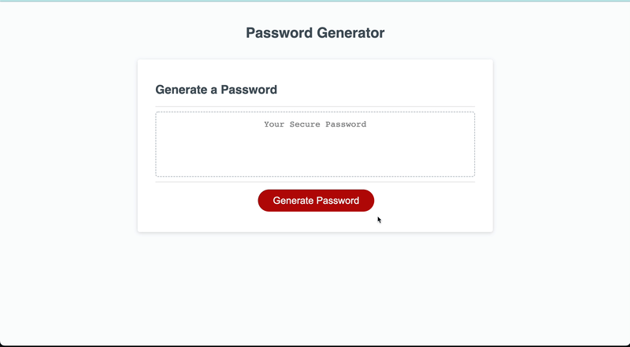

# Password Generator – Refactor

## Description

This repo contains the code used to develop and run a random password generator. The application is laid out and styled in HTML and CSS, and the password generation is powered by JavaScript.
 
Once active this application allows the user to generate a random password and set specific criteria like password length and character sets to align with the user's needs.
 
The main things I learned in this process:
- A better understanding of JavaScript, specifically its syntax and rules surrounding functions and methods.
- How to produce a random string based on specific arrays of information.
- How to display the final product produced by a JavaScript function so that it appears on the page itself via an alert.

## Installation

To install and work on the refactored code on your machine, clone down the index.html, style.css, script.js, and README.md. Then open them in a source code editor.
 
Worth noting that this repo also includes an 'images' folder. This is not necessary to run the code as it just contains the demo gif used in this README in the section below.

## Usage

The active application will generate a random password based on the users inputs of how many characters and what character sets they would like to use. Once the length and character sets have been chosen an alert will show with the new password.
 
Here is a quick demo of the process:
 
   
 
You can find an active version of the application here: https://rdahltorp.github.io/password-generator-refactor/

## Credits

- Original HTML, CSS, and JS code provided by the University of Denver Fullstack Coding Bootcamp course.
- To help get a better understanding of randomization in JS, I utilized the linked YouTube tutorial by user @{RhymBil}. Link: https://youtu.be/jww3V2fSQyg

## Features

This password generator allows the user to develop a randomly generated password using any combination of the following criteria options:
- Password length (between 8 and 128 characters)
- Use of lowercase letters
- Use of uppercase letters
- Use of numbers
- Use of special characters

## Tests

This application uses a lot of duplicate (but slightly adjusted) code in the JavaScript in order to randomize a password based on the various user criteria option combinations. In order to confirm the code is working properly in all scenarios, the best way I found to test is to keep a log of the possible criteria combinations and test them each individually.
 
For more context, here is a link to the criteria combinations and test tracker I used: https://docs.google.com/spreadsheets/d/1YKy1r9iXkBgAO-LHjsUFukTf4CEvGc2yIEoEh2Fjx5Q/edit?usp=sharing
